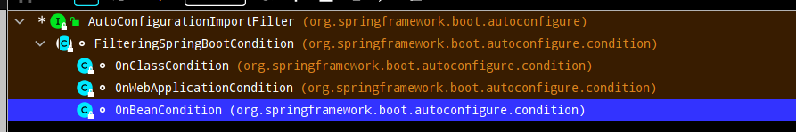
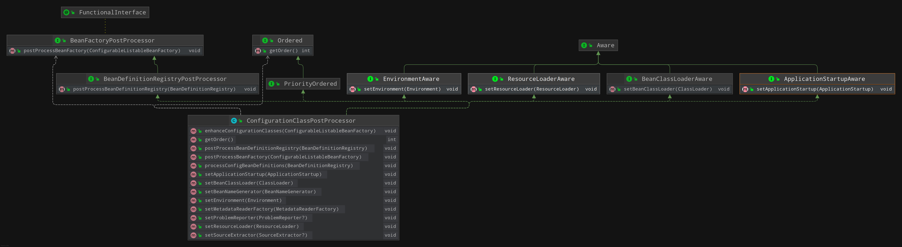

# [SpringBoot是如何做到自动装配的](https://www.cnblogs.com/chenzw93/p/15919696.html)

### 背景

众所周知，如下即可启动一个最简单的Spring应用。查看`@SpringBootApplication`注解的源码，发现这个注解上有一个重要的注解`@EnableAutoConfiguration`，而这个注解就是SpringBoot实现自动装配的基础

```java
import org.springframework.boot.SpringApplication;
import org.springframework.boot.autoconfigure.SpringBootApplication;

@SpringBootApplication
public class DemoApplication {
	public static void main(String[] args) {
		SpringApplication.run(DemoApplication.class, args);
	}
}
```

#### @EnableAutoConfiguration

`EnableAutoConfiguration`注解上通过`@Import`引入了两个类，`org.springframework.boot.autoconfigure.AutoConfigurationImportSelector`及`org.springframework.boot.autoconfigure.AutoConfigurationPackages.Registrar`。通过`@Import`标注的类，会在解析`@Import`所在的配置类时，将标注类引入容器解析，并进行注册。

有众多的组件都是通过在配置类上加`@EnableAutoConfiguration`注解将组件引入的

> - `ImportBeanDefinitionRegistrar`实现了`org.springframework.context.annotation.ImportBeanDefinitionRegistrar`及`org.springframework.boot.context.annotation.DeterminableImports`
> - `AutoConfigurationImportSelector`实现了`org.springframework.context.annotation.DeferredImportSelector`

```java
@Target(ElementType.TYPE)
@Retention(RetentionPolicy.RUNTIME)
@Documented
@Inherited
@AutoConfigurationPackage
@Import(AutoConfigurationImportSelector.class)
public @interface EnableAutoConfiguration {
    ....
}

@Target(ElementType.TYPE)
@Retention(RetentionPolicy.RUNTIME)
@Documented
@Inherited
@Import(AutoConfigurationPackages.Registrar.class)
public @interface AutoConfigurationPackage {
    ...
}
```

### 解析

#### 起始

通过`BeanFactoryPostProcessor`对需要注册的Bean进行解析。即`org.springframework.context.support.AbstractApplicationContext#refresh`，在`AbstractApplicationContext#invokeBeanFactoryPostProcessors`方法调用时，就开始了对服务配置bean的解析，为对象的生成做准备

```java
        @Override
	public void refresh() throws BeansException, IllegalStateException {
		synchronized (this.startupShutdownMonitor) {
			...

			try {
				...
                    
				invokeBeanFactoryPostProcessors(beanFactory);

				...
			}

			catch (BeansException ex) {
				...
			}

			finally {
				...
			}
		}
	}
```

#### 具体解析

调用`org.springframework.context.support.PostProcessorRegistrationDelegate#invokeBeanFactoryPostProcessors`，通过获取到的`BeanFactoryPostProcessor`实现类对各种配置类进行解析，具体的`BeanFactoryPostProcessor`解析后面我们在具体分析。

这里有一个很重要的类`org.springframework.context.annotation.ConfigurationClassPostProcessor`，首先会调用`postProcessBeanDefinitionRegistry`方法

```java
	// ConfigurationClassPostProcessor类部门源码

	/**
	 * Derive further bean definitions from the configuration classes in the registry.
	 */
	@Override
	public void postProcessBeanDefinitionRegistry(BeanDefinitionRegistry registry) {
		int registryId = System.identityHashCode(registry);
		if (this.registriesPostProcessed.contains(registryId)) {
			throw new IllegalStateException(
					"postProcessBeanDefinitionRegistry already called on this post-processor against " + registry);
		}
		if (this.factoriesPostProcessed.contains(registryId)) {
			throw new IllegalStateException(
					"postProcessBeanFactory already called on this post-processor against " + registry);
		}
		this.registriesPostProcessed.add(registryId);
	
                // 处理配置类
		processConfigBeanDefinitions(registry);
	}


	/**
	 * Build and validate a configuration model based on the registry of
	 * {@link Configuration} classes.
	 */
	public void processConfigBeanDefinitions(BeanDefinitionRegistry registry) {
		...
		// Parse each @Configuration class
		ConfigurationClassParser parser = new ConfigurationClassParser(
				this.metadataReaderFactory, this.problemReporter, this.environment,
				this.resourceLoader, this.componentScanBeanNameGenerator, registry);

                // configCandidates为待解析的Configuration类，如配置了@SpringBootApplication的类
		Set<BeanDefinitionHolder> candidates = new LinkedHashSet<>(configCandidates);
		Set<ConfigurationClass> alreadyParsed = new HashSet<>(configCandidates.size());
		do {
			StartupStep processConfig = this.applicationStartup.start("spring.context.config-classes.parse");
                        // 开始解析
			parser.parse(candidates);
			parser.validate();

			...
		}
		while (!candidates.isEmpty());
		...
	}
```

通过源码可知，具体的解析操作是在`org.springframework.context.annotation.ConfigurationClassParser`类中

```java
public void parse(Set<BeanDefinitionHolder> configCandidates) {
		for (BeanDefinitionHolder holder : configCandidates) {
			BeanDefinition bd = holder.getBeanDefinition();
			try {
				if (bd instanceof AnnotatedBeanDefinition) {
                                        // 将配置类进行解析。以当前配置类为原配置类，解析@PropertySource、@ComponentScan、@Import、@ImportResource、					 
                                        // @Bean等标注的类或方法，生成对应的
					parse(((AnnotatedBeanDefinition) bd).getMetadata(), holder.getBeanName());
				}
				else if (bd instanceof AbstractBeanDefinition && ((AbstractBeanDefinition) bd).hasBeanClass()) {
					parse(((AbstractBeanDefinition) bd).getBeanClass(), holder.getBeanName());
				}
				else {
					parse(bd.getBeanClassName(), holder.getBeanName());
				}
			}
			...
		}

   		// 解析通过@Import引入的配置类，自动配置类的解析也在于此
		this.deferredImportSelectorHandler.process();
	}

	public void processGroupImports() {
			for (DeferredImportSelectorGrouping grouping : this.groupings.values()) {
				Predicate<String> exclusionFilter = grouping.getCandidateFilter();
                                // grouping.getImports()方法获取到了所有配置的可用自动配置类，然后遍历，以配置类原点又开始一轮解析。自动装配就是在此处
				grouping.getImports().forEach(entry -> {
					ConfigurationClass configurationClass = this.configurationClasses.get(entry.getMetadata());
					try {
                                                // import的解析
						processImports(configurationClass, asSourceClass(configurationClass, exclusionFilter),
								Collections.singleton(asSourceClass(entry.getImportClassName(), exclusionFilter)),
								exclusionFilter, false);
					}
					catch (BeanDefinitionStoreException ex) {
						throw ex;
					}
					catch (Throwable ex) {
						throw new BeanDefinitionStoreException(
								"Failed to process import candidates for configuration class [" +
										configurationClass.getMetadata().getClassName() + "]", ex);
					}
				});
			}
		}
```

通过`DeferredImportSelectorGrouping.getImports()`方法解析。在`org.springframework.boot.autoconfigure.AutoConfigurationImportSelector#getAutoConfigurationEntry`方法中开始了autoConfiguration的解析。

```java
	/**
	 * Return the {@link AutoConfigurationEntry} based on the {@link AnnotationMetadata}
	 * of the importing {@link Configuration @Configuration} class.
	 * @param annotationMetadata the annotation metadata of the configuration class
	 * @return the auto-configurations that should be imported
	 */
	protected AutoConfigurationEntry getAutoConfigurationEntry(AnnotationMetadata annotationMetadata) {
		if (!isEnabled(annotationMetadata)) {
			return EMPTY_ENTRY;
		}
                // 解析@EnableAutoConfiguration注解中的属性exclude、excludeName
		AnnotationAttributes attributes = getAttributes(annotationMetadata);
                // 使用SpringFactoriesLoader获取META-INF/spring.properties中配置的EnableAutoConfiguration实现类，获取所有配置的自动装配类
		List<String> configurations = getCandidateConfigurations(annotationMetadata, attributes);
                // 去重
		configurations = removeDuplicates(configurations);
                // 获取需要排除的自动装配类
		Set<String> exclusions = getExclusions(annotationMetadata, attributes);
		checkExcludedClasses(configurations, exclusions);
		configurations.removeAll(exclusions);
                //getConfigurationClassFilter()方法就是获取spring.factories中配置的AutoConfigurationImportFilter实现类。然后调用filter		//法对自动装配类进行有效性校验
		configurations = getConfigurationClassFilter().filter(configurations);
		fireAutoConfigurationImportEvents(configurations, exclusions);
		return new AutoConfigurationEntry(configurations, exclusions);
	}
```

再继续看`org.springframework.boot.autoconfigure.AutoConfigurationImportSelector.ConfigurationClassFilter#filter`

```java
	List<String> filter(List<String> configurations) {
			long startTime = System.nanoTime();
			String[] candidates = StringUtils.toStringArray(configurations);
			boolean skipped = false;
			for (AutoConfigurationImportFilter filter : this.filters) {
                                // autoConfigurationMetadata为通过META-INF/spring-autoconfigure-metadata.properties配置文件的内容
                                // 使用filter及autoConfigurationMetadata对candidates进行校验
				boolean[] match = filter.match(candidates, this.autoConfigurationMetadata);
				for (int i = 0; i < match.length; i++) {
					if (!match[i]) {
						candidates[i] = null;
						skipped = true;
					}
				}
			}
			if (!skipped) {
				return configurations;
			}
        	...
			return result;
		}
```

再继续看match方法，`org.springframework.boot.autoconfigure.condition.FilteringSpringBootCondition#match`



```java
	@Override
	public boolean[] match(String[] autoConfigurationClasses, AutoConfigurationMetadata autoConfigurationMetadata) {
		ConditionEvaluationReport report = ConditionEvaluationReport.find(this.beanFactory);
                // 抽象方法，不同的filter进行不同的处理。这里会获取每一个自动装配类的条件判断情况
		ConditionOutcome[] outcomes = getOutcomes(autoConfigurationClasses, autoConfigurationMetadata);
		boolean[] match = new boolean[outcomes.length];
		for (int i = 0; i < outcomes.length; i++) {
			match[i] = (outcomes[i] == null || outcomes[i].isMatch());
			if (!match[i] && outcomes[i] != null) {
				logOutcome(autoConfigurationClasses[i], outcomes[i]);
				if (report != null) {
					report.recordConditionEvaluation(autoConfigurationClasses[i], this, outcomes[i]);
				}
			}
		}
		return match;
	}
```

通过match方法，经过多种filter的过滤，返回的就是每一个自动配置类是否可用

### 结论

- `SpringBoot`项目有一个子项目`org.springframework.boot:spring-boot-autoconfigure:xx`，这个子项目主要就是做自动装配的。`SpringBoot`提前配置了众多已经实现自动配置功能的配置类(`org.springframework.boot.autoconfigure.EnableAutoConfiguration`接口的实现类)。当容器启动的时候，通过 `SpringFactoriesLoader`将配置类加载进容器中
- 启动中，容器通过`BeanFactoryPostProcessor`接口解析、修改对象的定义。有一个很重要的配置解析实现类`org.springframework.context.annotation.ConfigurationClassPostProcessor`，用来解析项目中标注`@Configuration`的类
- 在进行配置类解析时(即解析配置了`@SpringBootApplication`注解的类)，需要经过解析类的`@PropertySource`、`@ComponentScan`、`@Import`、`@ImportResource`、`@Bean`、接口默认实现、父类等（`org.springframework.context.annotation.ConfigurationClassParser#doProcessConfigurationClass`）。对于自动装配来说，最重要的就是解析`@Import`
- 通过`@Import`引入了`org.springframework.boot.autoconfigure.AutoConfigurationImportSelector`，在进行解析`@Import`引入的配置类时，`org.springframework.boot.autoconfigure.AutoConfigurationImportSelector#getAutoConfigurationEntry`获取到所有配置的自动装配类(通过`META-INF/spring.factories`文件配置`EnableAutoConfiguration`实现类)，通过`org.springframework.context.annotation.Condition`定义过滤器，判断自动装配置是否需要自动装配。默认的过滤器有`OnClassCondition`、`OnWebApplicationCondition`、`OnBeanCondition`，对应常见的condition注解`ConditionalOnClass`、`ConditionalOnBean`、`@ConditionalOnWebApplication`。
- 通过过滤判断，将需要自动配置的类进行configuration解析，从而将需要配置的类转换成对应的`BeanDefinition`进行注册

### 备注

- SpringBoot将自动装配类及过滤条件通过配置文件的形式放在了`META-INF`目录下，`META-INF/spring.factories`和`META-INF/spring-autoconfigure-metadata.properties`

- 在`BeanFactoryPostProcessor`进行调用时，有两种处理。首先是通过`BeanDefinitionRegistryPostProcessor#postProcessBeanDefinitionRegistry`解析更多的`BeanDefinition`，在这里就包含了所有标注类的扫描解析，自动装配类的解析，自动装配类引入类的解析。在进行`BeanFactoryPostProcessor#postProcessBeanFactory`调用，进行CGLIB-enhanced配置类。这里最重要的一个类就是`org.springframework.context.annotation.ConfigurationClassPostProcessor`，以下为此类的继承关系

  
  