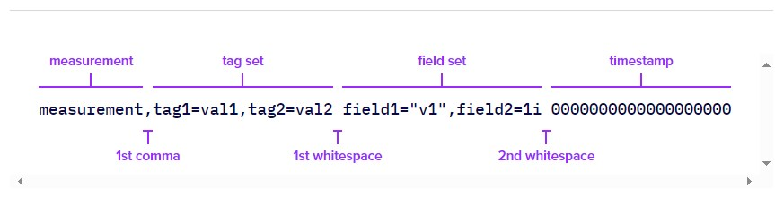

# InfluxDB2

## 简介

[InfluxDB OSS v2 Documentation (influxdata.com)](https://docs.influxdata.com/influxdb/v2/)

### 安装

#### Start

```sh
#nohup ./influxd --http-bind-address=:8086 --query-concurrency=10000 --nats-max-payload-bytes=10485760000 --storage-cache-max-memory-size=0 --sqlite-path=xxx/xx.sqlite --engine-path=xxx/engine --bolt-path=xx/influxd.bolt >> xx.log 2>&1 &

./influxd --http-bind-address=:8086 --query-concurrency=10000 --nats-max-payload-bytes=10485760000 --storage-cache-max-memory-size=0 --sqlite-path=xxx/xx.sqlite --engine-path=xxx/engine --bolt-path=xx/influxd.bolt 
```

> [http-bind-address](https://docs.influxdata.com/influxdb/v2/reference/config-options/#http-bind-address)
>
> [query-concurrency](https://docs.influxdata.com/influxdb/v2/reference/config-options/#query-concurrency)
>
> [nats-max-payload-bytes](https://docs.influxdata.com/influxdb/v2/reference/config-options/#nats-max-payload-bytes) **deprecated in InfluxDB 2.2** and no longer has any effect.
>
> [storage-cache-max-memory-size](https://docs.influxdata.com/influxdb/v2/reference/config-options/#storage-cache-max-memory-size) 单位是bytes，默认是1024M
>
> [sqlite-path](https://docs.influxdata.com/influxdb/v2/reference/config-options/#sqlite-path) 存储依赖的metadata
>
> [engine-path](https://docs.influxdata.com/influxdb/v2/reference/config-options/#engine-path) 存储时序结构的目录
>
> [bolt-path](https://docs.influxdata.com/influxdb/v2/reference/config-options/#bolt-path) `boltDB Database`，存储org，user相关数据

#### setUp


## 相关概念

### Time Series Data

按时间顺序索引的数据点序列，数据点通常从相同的数据点进行的连续测量组成，用于追踪随时间推移的变化

* 工业传感器数据
* 服务器性能指标
* 每分钟检测信号数
* 股价

 ### Data organization

InfluxDB会将数据存储到 `Buckets` 和 `measurements`，一个`Buckets` 可以包含多个 `measurements`， `measurements`可以包含多个`tags`和`fields`

* Bucket

  > 存储时序数据的命名位置。单个Bucket可以包含多个 Measurement

  * Measurement

    > 时间序列数据的逻辑分组。同一个的measurement中的 点`Point` 必须有相同的Tags。单个measurement可以包含多个tags和fields

    * Tags

      > key-value。不经常改变。用于存储每个点的元数据，用于识别数据源的东西，如：主机，位置，站点

    * Fields

      > key-value。值随时间变化。其实就是真正存储的点的数据，如：温度、压力、股票价格

    * Timestamp

      > 与数据关联的时间戳。当存储在磁盘上并查询时，所有数据都按时间进行排序

### 一些重要定义

**Point**：单条数据记录的定义，包含measurement，tag keys，tag values，field key，timestamp

**Series**：一组包含相同measurement，tag keys, tag values的点


> series1
> | _time                | _measurement | city   | country | _field      | _value |
> | -------------------- | ------------ | ------ | ------- | ----------- | ------ |
> | 2022-01-01T12:00:00Z | weather      | London | UK      | temperature | 12.0   |
> | 2022-02-01T12:00:00Z | weather      | London | UK      | temperature | 12.1   |
> | 2022-03-01T12:00:00Z | weather      | London | UK      | temperature | 11.5   |
> | 2022-04-01T12:00:00Z | weather      | London | UK      | temperature | 5.9    |
>
>series2
>
> | _time                | _measurement | city    | country | _field      | _value |
> | -------------------- | ------------ | ------- | ------- | ----------- | ------ |
> | 2022-01-01T12:00:00Z | weather      | Cologne | DE      | temperature | 13.2   |
> | 2022-02-01T12:00:00Z | weather      | Cologne | DE      | temperature | 11.5   |
> | 2022-03-01T12:00:00Z | weather      | Cologne | DE      | temperature | 10.2   |
> | 2022-04-01T12:00:00Z | weather      | Cologne | DE      | temperature | 7.9    |

## 使用

### 写数据

使用工具有多种，如下

- Influx user interface (UI)
- [InfluxDB HTTP API](https://docs.influxdata.com/influxdb/v2/reference/api/)
- [`influx` CLI](https://docs.influxdata.com/influxdb/v2/tools/influx-cli/)
- [Telegraf](https://docs.influxdata.com/telegraf/v1/)
- [InfluxDB client libraries](https://docs.influxdata.com/influxdb/v2/api-guide/client-libraries/)

#### 数据结构

支持多种方式。使用InfluxDB Client之类的，也会构建LINE协议调用InfluxDB，所以需要了解下Line协议

##### [Line protocol element parsing](https://docs.influxdata.com/influxdb/v2/get-started/write/#line-protocol-element-parsing)



- **measurement**：用于标识要在其中存储数据的[度量](https://docs.influxdata.com/influxdb/v2/get-started/write/)的字符串

  > 第一个*空格之前第一个未转义逗号*之前的所有内容

- **tag set**：以逗号分隔的键值对列表，每个键值对代表一个标签。 标记键和值是不带引号的字符串。*必须对空格、逗号和等字符进行转义。

  > 第一个未转义的*逗号和第一个未转义的空格*之间的键值对

- **field set**：以逗号分隔的列表键值对，每个键对代表一个字段。 字段键是不带引号的字符串。*必须对空格和逗号进行转义。*字段值可以是[字符串](https://docs.influxdata.com/influxdb/v2/reference/syntax/line-protocol/#string)（带引号）、[浮点](https://docs.influxdata.com/influxdb/v2/reference/syntax/line-protocol/#float)数、整数、[无符号整数](https://docs.influxdata.com/influxdb/v2/reference/syntax/line-protocol/#uinteger)、 或[布尔值](https://docs.influxdata.com/influxdb/v2/reference/syntax/line-protocol/#boolean)

  > *第一个和第二个未转义空格*之间的键值对

- **timestamp**：与数据关联的 [Unix 时间戳](https://docs.influxdata.com/influxdb/v2/reference/syntax/line-protocol/#unix-timestamp)。InfluxDB 支持高达 nans 级的精度。*如果时间戳的精度不是以纳秒为单位，则必须指定 将数据写入 InfluxDB 时的精度

  > *第二个未转义空格*后的整数值

Lines are separated by the newline character (). Line protocol is whitespace sensitive.`\n`

##### Use tags and fields

[InfluxDB schema design | InfluxDB OSS v2 Documentation (influxdata.com)](https://docs.influxdata.com/influxdb/v2/write-data/best-practices/schema-design/#use-tags-and-fields)

###### Tags

* 会建立索引
* 如果对应字段被使用在 `filter()` 或者 `group()`
* 值在多个Points中共用

###### Fields

* 存储唯一或者频繁变化的值
* 可以存储数字化的值（tags只存储strings）

#### schema设计

[InfluxDB schema design | InfluxDB OSS v2 Documentation (influxdata.com)](https://docs.influxdata.com/influxdb/v2/write-data/best-practices/schema-design/)

总的来说其实可以归纳为

* 将measurement和tags中的key尽可能简单，一个key代表一个含义，在后续做汇总分析时，会比较高效？

* 不要在key中使用**关键字**或者**特殊字符**

  > 如果在键中使用 [Flux 关键字](https://docs.influxdata.com/flux/v0/spec/lexical-elements/#keywords)， 然后，您必须将密钥括在双引号中。 如果在键中使用非字母数字字符，则必须在 [Flux](https://docs.influxdata.com/flux/v0/) 中使用[括号表示法](https://docs.influxdata.com/flux/v0/data-types/composite/record/#bracket-notation)

* tags和fields中不要使用相同的key

### 查数据

使用工具多种，包括


主要的两种查询语音：

#### Flux

一种用于查询和处理数据的功能性脚本语言 来自 InfluxDB 和其他数据源

* from()

  指定measurement。`from(bucket: "get-started")`

* range()

  根据时间限制筛选数据。Flux 需要“有界”查询，查询**仅限于**特定时间范围。`range(start: 2022-01-01T08:00:00Z, stop: 2022-01-01T20:00:01Z)`

* filter()

  根据列值筛选数据。每一行由 表示，每列由**属性**表示。 可以应用多个后续筛选器

* `|>`

  管道转发符。将上一个函数的输出转化为下一个函数的输入

  ```shell
  from(bucket: "get-started")
      |> range(start: 2022-01-01T08:00:00Z, stop: 2022-01-01T20:00:01Z)
      |> filter(fn: (r) => r._measurement == "home")
      |> filter(fn: (r) => r._field== "co" or r._field == "hum" or r._field == "temp")
  ```

#### InfluxQL

一种类似 SQL 的查询语言，旨在从以下位置查询时间序列数据 InfluxDB

主要为0.x和1.x设计的，2.7之后的如果要使用，需要[将数据库和保留策略 （DBRP） 组合映射到 InfluxDB 存储桶](https://docs.influxdata.com/influxdb/v2/query-data/influxql/dbrp/)


### [数据处理](https://docs.influxdata.com/influxdb/v2/get-started/process/)

#### map()

**修改某个字段值或者新增字段**

* 新增field或者修改某个字段的值

  ```shell
  #修改_value的值；新增字段degrees并赋值F
  from(bucket: "get-started")
      |> range(start: 2022-01-01T08:00:00Z, stop: 2022-01-01T20:00:01Z)
      |> filter(fn: (r) => r._measurement == "home")
      |> filter(fn: (r) => r._field == "hum")
      |> map(fn: (r) => ({r with _value: (r._value * 1.8) + 32.0, degrees: "F"}))
  
  #替换原有的所有tag和field。
  from(bucket: "get-started")
      |> range(start: 2022-01-01T08:00:00Z, stop: 2022-01-01T20:00:01Z)
      |> map(fn: (r) => ({ _time: r._time, _field: "temp_F", _value: (r._value * 1.8) + 32.0}))
  ```

* map + `if/then/else`

  ```shell
  # 新增state字段. 根据_value的值进行判断，并赋值
  from(bucket: "get-started")
      |> range(start: 2022-01-01T14:00:00Z, stop: 2022-01-01T20:00:01Z)
      |> filter(fn: (r) => r._measurement == "home")
      |> filter(fn: (r) => r._field == "co")
      |> map(fn: (r) => ({r with state: if r._value < 10 then "ok" else "warning"}))
  ```

#### group()

**对数据进行分组** 

* 按照field进行数据合并分组

  ```shell
  from(bucket: "get-started")
      |> range(start: 2022-01-01T08:00:00Z, stop: 2022-01-01T10:00:01Z)
      |> filter(fn: (r) => r._measurement == "home")
      |> filter(fn: (r) => r._field == "temp" or r._field == "hum")
      |> group(columns: ["_field"])
  ```

* ungroup

  ```shell
  from(bucket: "get-started")
      |> range(start: 2022-01-01T08:00:00Z, stop: 2022-01-01T10:00:01Z)
      |> filter(fn: (r) => r._measurement == "home")
      |> filter(fn: (r) => r._field == "temp" or r._field == "hum")
      |> group()
  ```

#### 数据汇聚 Aggregate

##### mean()

```shell
# 求每个房间的温度平均值。返回两条记录
from(bucket: "get-started")
    |> range(start: 2022-01-01T14:00:00Z, stop: 2022-01-01T20:00:01Z)
    |> filter(fn: (r) => r._measurement == "home")
    |> filter(fn: (r) => r._field == "temp")
    |> mean()
    
 # 求所有房间的温度平均值。返回一条记录
from(bucket: "get-started")
    |> range(start: 2022-01-01T14:00:00Z, stop: 2022-01-01T20:00:01Z)
    |> filter(fn: (r) => r._measurement == "home")
    |> filter(fn: (r) => r._field == "temp")
    |> group()
    |> mean()
      
```

##### toFloat()

##### count()

##### duplicate()

#### 选择器函数

##### first()

##### last()

##### max()

### 数据可视化


## 数据示例

```shell
home,room=Living\ Room temp=21.1,hum=35.9,co=0i 1641024000
home,room=Kitchen temp=21.0,hum=35.9,co=0i 1641024000
home,room=Living\ Room temp=21.4,hum=35.9,co=0i 1641027600
home,room=Kitchen temp=23.0,hum=36.2,co=0i 1641027600
home,room=Living\ Room temp=21.8,hum=36.0,co=0i 1641031200
home,room=Kitchen temp=22.7,hum=36.1,co=0i 1641031200
home,room=Living\ Room temp=22.2,hum=36.0,co=0i 1641034800
home,room=Kitchen temp=22.4,hum=36.0,co=0i 1641034800
home,room=Living\ Room temp=22.2,hum=35.9,co=0i 1641038400
home,room=Kitchen temp=22.5,hum=36.0,co=0i 1641038400
home,room=Living\ Room temp=22.4,hum=36.0,co=0i 1641042000
home,room=Kitchen temp=22.8,hum=36.5,co=1i 1641042000
home,room=Living\ Room temp=22.3,hum=36.1,co=0i 1641045600
home,room=Kitchen temp=22.8,hum=36.3,co=1i 1641045600
home,room=Living\ Room temp=22.3,hum=36.1,co=1i 1641049200
home,room=Kitchen temp=22.7,hum=36.2,co=3i 1641049200
home,room=Living\ Room temp=22.4,hum=36.0,co=4i 1641052800
home,room=Kitchen temp=22.4,hum=36.0,co=7i 1641052800
home,room=Living\ Room temp=22.6,hum=35.9,co=5i 1641056400
home,room=Kitchen temp=22.7,hum=36.0,co=9i 1641056400
home,room=Living\ Room temp=22.8,hum=36.2,co=9i 1641060000
home,room=Kitchen temp=23.3,hum=36.9,co=18i 1641060000
home,room=Living\ Room temp=22.5,hum=36.3,co=14i 1641063600
home,room=Kitchen temp=23.1,hum=36.6,co=22i 1641063600
home,room=Living\ Room temp=22.2,hum=36.4,co=17i 1641067200
home,room=Kitchen temp=22.7,hum=36.5,co=26i 1641067200
```

